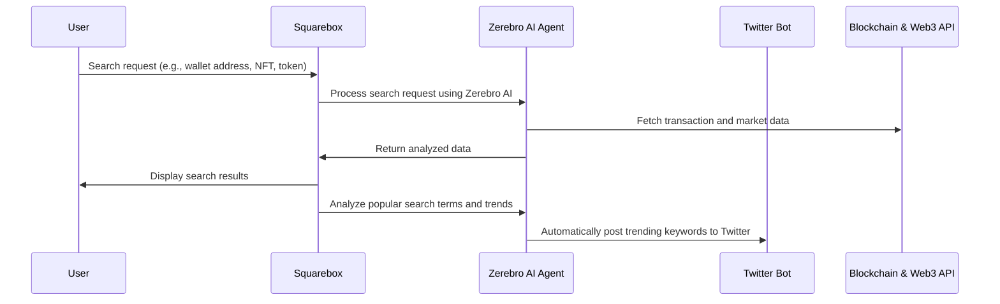

# Squarebox

[Demo](https://squarebox-ten.vercel.app/) | [Video]() 

### **Project: Squarebox**  

#### **Overview**  
Squarebox is an **AI-powered Web3 search engine that tracks and promotes the latest trends in the Sonic ecosystem**.  
By utilizing AI, it analyzes **keywords and blockchain data** based on user searches and **automatically promotes trending topics on Twitter through agent bots**. This allows users to **easily search for Web3 trends and transaction history** while also **automatically sharing the most discussed keywords and trends**.  

Additionally, Squarebox leverages **Zerebro AI** to **integrate and analyze blockchain and social media data comprehensively**.  
This enables Web3 users to **track token transactions, newly launched NFTs, and blockchain trends**, providing quick and easy access to the latest developments.  

---

### **Problem Statement**  
Web3 users face challenges in finding **the latest blockchain trends, NFT launches, and token transaction details** efficiently.  
- Existing platforms like OpenSea and Etherscan require **manual searching** and lack automated trend analysis and promotion.  
- There is no service that **automatically provides and promotes the most discussed keywords and trends** from blockchain and Twitter in real time.  

---

### **Solution**  
Squarebox is a **platform that searches, analyzes, and promotes the latest trends in the Sonic ecosystem using Zerebro AI**.  
It **aggregates and filters user search terms** to analyze **blockchain transaction data and social media trends**, then **automatically promotes them via a Twitter agent bot**.  

---

### **Key Features**  
✅ **AI-Powered Search & Trend Analysis**  
- **Zerebro AI** matches user search terms with **the latest trends in the Sonic ecosystem**  
- **Provides real-time, personalized blockchain search results**  

✅ **Automated Twitter Trend Promotion**  
- **Tracks the most frequently searched keywords and trends**  
- **AI-based Twitter agent bot** automatically posts updates  

✅ **Blockchain Data & NFT Search**  
- **Wallet address search** displays **transaction history**  
- **Recently launched NFTs and tokens** are displayed along with **relevant details**  

✅ **Personalized Web3 Insights**  
- **Automatically collects related Twitter posts based on the tokens in a user’s wallet**  
- Example: If a user **holds Arbitrum**, Squarebox **displays Arbitrum-related Twitter posts**  

✅ **Sonic Network Integration**  
- **Optimized search and trend analysis within the Sonic ecosystem**  
- As a **Sonic Hackathon project**, it provides **the best Web3 data search experience**  

✅ **Powered by Zerebro AI**  
- **Zerebro autonomously analyzes blockchain and social media data**  
- **ZerePy open-source framework** allows for quick deployment of custom AI agents  

---

### **System Architecture Diagram**  

