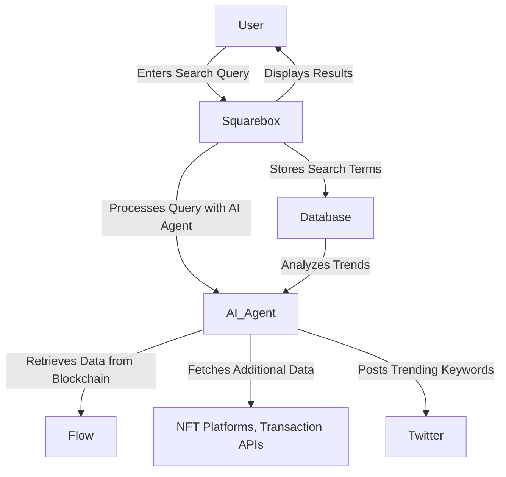

# Squarebox

[Demo](https://squarebox-ten.vercel.app/) | [Video]() 

## Overview
Squarebox is an AI-powered Web3 search engine that enhances blockchain data discovery. It utilizes AI agents to provide curated search results, track trending keywords, and display relevant insights on Twitter. By integrating blockchain data retrieval, NFT search, and personalized token-related updates, Squarebox streamlines Web3 exploration for users.

## Problem Statement 
Traditional search engines and Web3 platforms do not provide AI-powered assistance for blockchain-related searches. Users must manually navigate multiple services, such as OpenSea for NFTs or Etherscan for transaction history, making Web3 exploration inefficient and fragmented. Additionally, there is no automated way to track and analyze trending search terms within the Web3 space.  

## Solution  
Squarebox leverages AI to recommend blockchain-related content based on user search queries, eliminating the need for manual exploration. The platform also collects and categorizes search terms, identifying trends and displaying the most searched keywords on Twitter through AI agent bots.  

## Key Features
✅ **AI-Powered Search & Recommendations**  
- Uses AI to match user search terms with the most relevant Web3 content.  
- Provides curated search results for blockchain data, NFT projects, and transaction records.  

✅ **Keyword Trend Analysis**  
- Stores and categorizes search terms.  
- Identifies trending keywords and posts them on Twitter via AI agent bots.  

✅ **Blockchain Data Search**  
- Allows users to look up Ethereum addresses and retrieve transaction history.  
- Displays wallet activity and contract interactions.  

✅ **Integrated NFT & Token Search**  
- Enables users to search for NFTs across multiple platforms.  
- Displays sales locations, price history, transaction records, and related Twitter discussions.  

✅ **Personalized Twitter Insights**  
- Displays Twitter posts related to tokens found in the user’s wallet.  
- Example: If the user holds Arbitrum, the system fetches relevant Arbitrum tweets.  

✅ **Sonic Network Integration**  
- Optimized for the Sonic Network as part of the Sonic Hackathon.  
- Enhances data retrieval and search efficiency within Web3.  

## System Architecture Diagram

